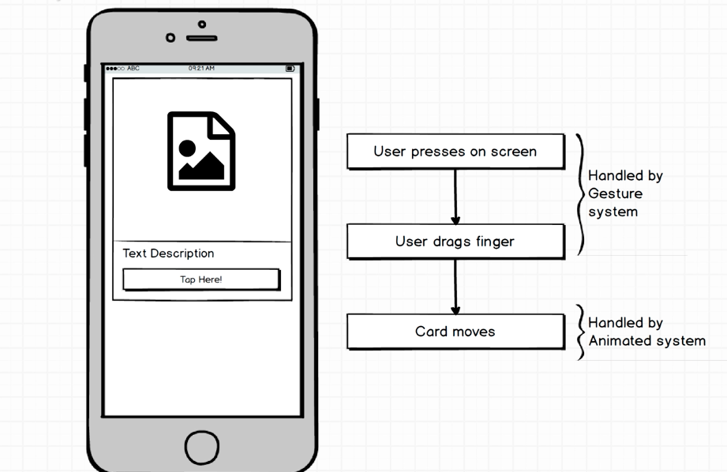
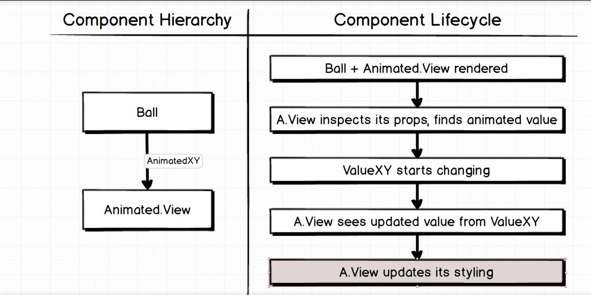
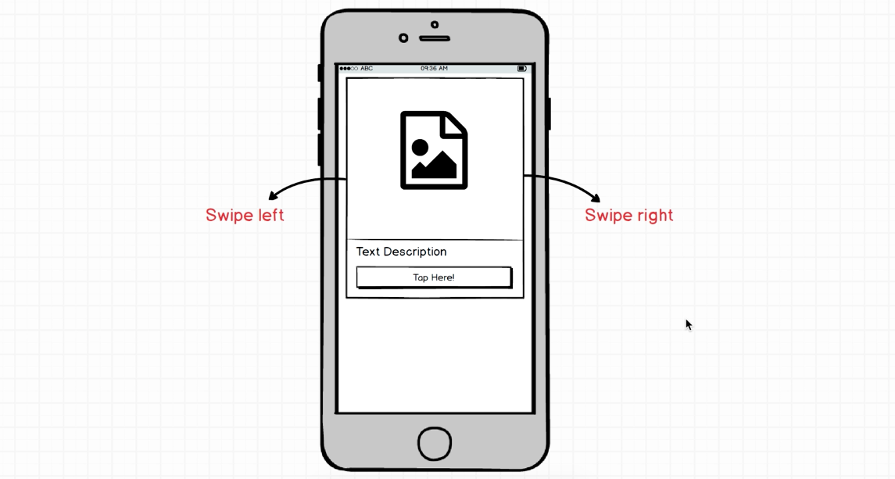
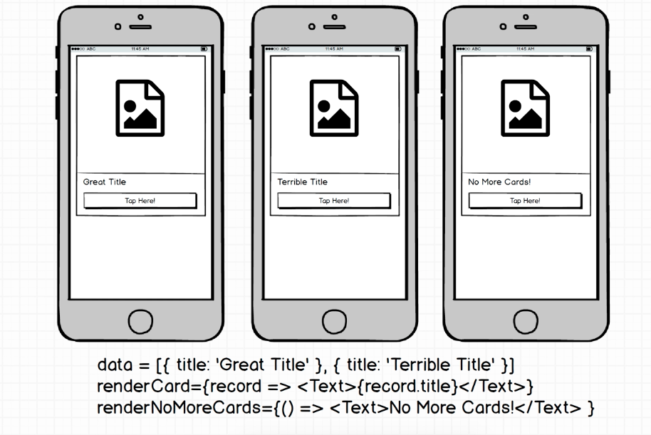
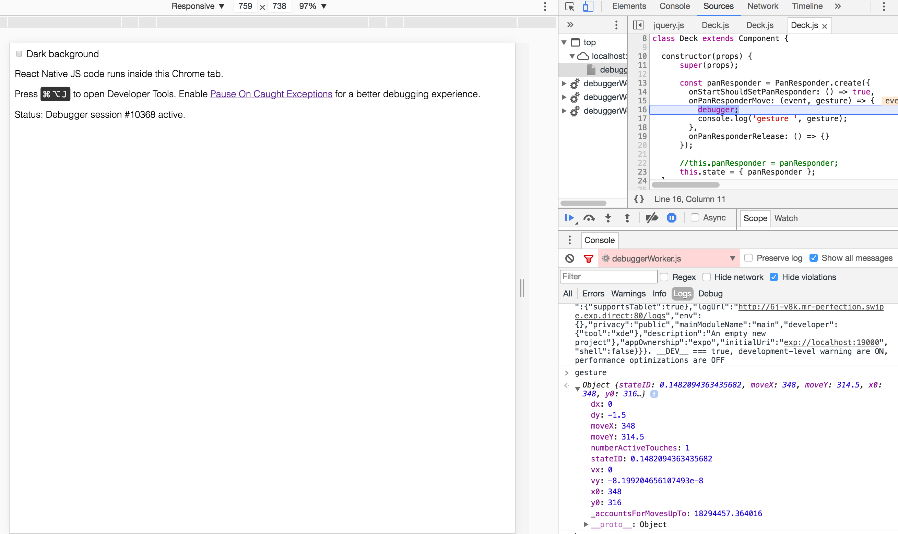

# tinder-clone
Swipe cards like Tinder!
In this React Native application, I will be demonstrating my understanding with animations & gesture system (panResponder) in react-native.


### Setup
```
$ npm install --save-dev eslint-config-rallycoding
$ npm install --save react-redux redux
$ npm install --save firebase
```

Expo XDE
```
    ------ LOG OUTPUTS----------
    |                           |
expo XDE -> JS Packager -> Expo App (Downloaded from App Store )
                ^
                |
                App code
Extra Device API
Easy push notification
Easy on device testing
Common extra components
```
### Animations system in React Native

**Layout Animation:**
* easy to Setup
* not much control

**Animated:**
* more complicated setup
* handle gesture animations

**[AnimatedValueXY](http://facebook.github.io/react-native/releases/0.44/docs/animated.html#animatedvaluexy)** to handle pan gestures.

```js
import { Animated } from 'react-native';

Animated.Value // What's the current position of the element being animated?
Animated.Types.Spring // how is the animation changing?
Animated.Components.View // Apply the animation's current position to an actual Component

// 1. Where is the item right now? Animated.ValueXY
this.position = new Animated.ValueXY(0,0);
// 2. Where is the item moving to? Animated.Spring
Animated.spring(this.position, {
  toValue: { x: 200, y: 500 }
}).start();
// 3. Which element are we moving? Animated.View
<Animated.View style={this.position.getLayout()}>
  <View style={styles.ball} />
</Animated.View>
```

### React Native Elements
Download it at [link](https://github.com/react-native-training/react-native-elements)
```bash
npm install react-native-elements
```

### Pan Responder (aka Gesture System)


1) what are we touching?
2) what component handles touch?
3) how is the gesture changing?


### Animated Component Lifecycle and Hierarchy



### Swipe Deck Feature


Prop  | Type  | Purpose
----- | ----- | -------
`renderCard`  |  function  |  Returns JSX to show inside of a card
`renderNoMoreCards`  |  function  |  Returns JSX when no more cards exist
`data`  |  array of objects  |  List of records to use for cards
`onSwpieRight` or `onSwipeLeft`  |  function  |  Called when user swipes left or right on an item



### Rotation as User Swipes

* `inputRange` sets how much pixels your finger would move the card. (left, default, right)
* `outputRange` sets how much degree your card would rotate based on your input or finger movement within `inputRange`.
```js
//...
getCardStyle() {
  const { position } = this.state;
  const rotate = position.x.interpolate({
    inputRange: [-500, 0, 500],
    outputRange: ['-120deg', '0deg', '120deg']
  });
  return {
    ...this.state.position.getLayout(),
    transform: [{ rotate }]
  };
}
//...

// The problem with the code above is depending on the screen size,
// inputRange may create too much or too small rotation with the given values.
// Set inputRange to be dependent on SCREEN_WIDTH
const SCREEN_WIDTH = Dimensions.get('window').width;

getCardStyle() {
  const { position } = this.state;
  const rotate = position.x.interpolate({
    inputRange: [-SCREEN_WIDTH * 2.0, 0, SCREEN_WIDTH * 2.0],
    outputRange: ['-120deg', '0deg', '120deg']
  });
  return {
    ...this.state.position.getLayout(),
    transform: [{ rotate }]
  };
}

// To bring back the card to the original position when swipe is incomplete (Deck.js)
//...
onPanResponderRelease: () => {
  this.resetPosition();
}
//...
resetPosition() {
  Animated.spring(this.state.position, {
    toValue: { x: 0, y: 0 }
  }).start();
}
//...

```
**The completed swiping version looks like this (click the image):**
[


### Testing
Using debugger in `Deck.js`
```js
const panResponder = PanResponder.create({
  onStartShouldSetPanResponder: () => true,
  onPanResponderMove: (event, gesture) => {
    debugger;
    console.log('gesture ', gesture);
  },
  onPanResponderRelease: () => {}
});
```
The code above makes use of `debugger`. The program will stop at the breakpoint where `debugger` is written.



Special thanks to Stephen Grider
https://www.udemy.com/react-native-advanced/learn/v4/t/lecture/6845196?start=0
